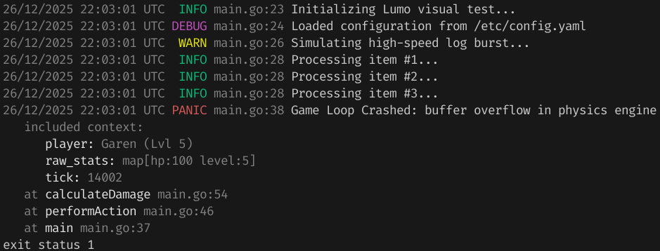

Lumo is a simple logger for Go, designed for hobby projects and small applications. It focuses on keeping logs readable and easy on the eyes without requiring complex configuration.

* **Easy to read:** Clear Rust-like formatting with colors to separate levels, timestamps, and messages.
* **Non-blocking:** Logs are handled asynchronously in a background worker.
* **Simple context support:** Attach variables to errors to see exactly what data caused a crash.
* **Pretty traces:** Stack traces filter out Go runtime internals so you only see your code.



### Installation
```bash
go get github.com/amatsagu/lumo
```

### Usage
Check `cmd/demo/main.go`.

> [!NOTE]  
> Color logs were tested only on Linux. Lumo is expected to be used in smaller, hobby apps that likely only use standard os stdout and something like systemctl or docker to control app logs.
